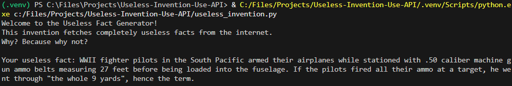

# Useless Fact Generator

A completely useless invention that fetches random useless facts from the internet using an API.

## Description

This Python script demonstrates the art of doing something pointless but technically functional. It uses the [Useless Facts API](https://uselessfacts.jsph.pl/) to retrieve random facts that serve no practical purpose whatsoever.

## Technologies Used

- **Python**: The programming language used to build the script.
- **requests**: A Python library for making HTTP requests to the API.
- **Useless Facts API**: An external REST API that provides random useless facts.

## Requirements

- Python 3.6+
- `requests` library

## Installation

1. Clone or download this repository.
2. Set up a virtual environment (optional but recommended):
   ```
   python -m venv .venv
   ```
3. Activate the virtual environment:
   - On Windows: `.venv\Scripts\activate`
4. Install dependencies:
   ```
   pip install requests
   ```

## Usage

Run the script:
```
python useless_invention.py
```

Or with the virtual environment:
```
.venv\Scripts\python.exe useless_invention.py
```

## Example Output

```
Welcome to the Useless Fact Generator!
This invention fetches completely useless facts from the internet.
Why? Because why not?

Your useless fact: Lawn darts are illegal in Canada.

Commentary: This fact is so useless, it might just change your life... or not.
```

## Demo



## Why?

Because sometimes, you just need a break from productivity.